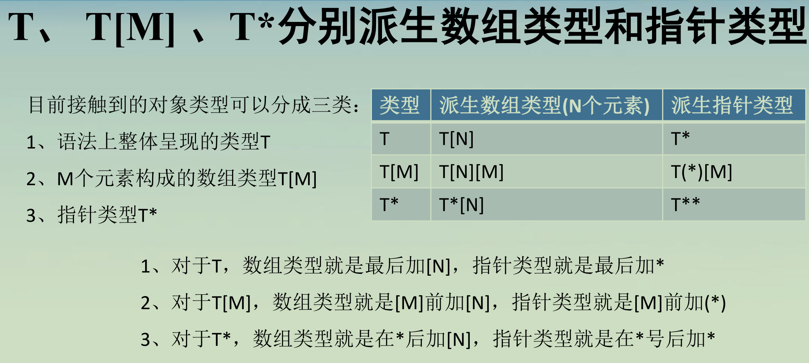

# 对象

C语言中对象的概念：提供的那块存储区域

以 int a = 10; 为例

| 概念 | 对应内容                              |
| ---- | ------------------------------------- |
| 对象 | 为这个整数提供的那块存储区域          |
| 名字 | `a`，用来标识这个对象                 |
| 类型 | `int`，决定如何解释数据、允许哪些操作 |
| 值   | 当前存储的 `10`                       |
| 地址 | `&a`，指向这个对象                    |
| 大小 | `sizeof a`，以字节为单位              |

| 概念     | 在这个例子中的含义                 |
| -------- | ---------------------------------- |
| 对象     | 为 `a` 提供的存储区域              |
| 对象表示 | 这块区域中存储的全部字节           |
| 对象的值 | 按 `int` 类型解释后得到的整数 `10` |

对象的类型决定它的大小和对齐要求；大小规定“占多少字节”，对齐要求规定“可以从什么地址开始存放”。

类型用来规定“数据是什么，以及可以怎样使用它”

完全对象类型和不完全对象类型，关键看类型信息是否足够确定大小，不是看有没有初值。

完全对象类型才有大小和对齐。

## 数组类型

数组类型不一定为完全对象类型

数组类型可以看成：元素类型 + 元素个数

其中元素类型必为完全对象类型

完全数组对象类型也能继续派生，

## 指针类型

一种用于表示“指向某种类型对象或函数的地址”的类型。

指针类型是完全对象类型

| 声明           | `p` 是什么                  | 对应类型名   |
| -------------- | --------------------------- | ------------ |
| `int (*p)[5];` | 指针，指向含 5 个整数的数组 | `int (*)[5]` |
| `int *p[5];`   | 数组，含 5 个整数指针       | `int *[5]`   |

## 限定符修饰类型

限定类型

1. const

通过这个对象本身，不能修改它的值

int * const p;

const int *p;

2. volatile

值可能在程序正常控制流之外发生变化，所以编译器不能随意省略对它的实际读写。

3. restrict

针对指针访问路径的别名约束

多个不同限定符与顺序无关

4. _Atomic

原子读写可以用于线程间同步

_Atomic(T) 中，T 不能是已经带限定符的类型；但 _Atomic 作为类型限定符时，可以和 const 等其他限定符共同修饰一个类型。

_Atomic(const int)      // ❌

_Atomic const int       // ✓
