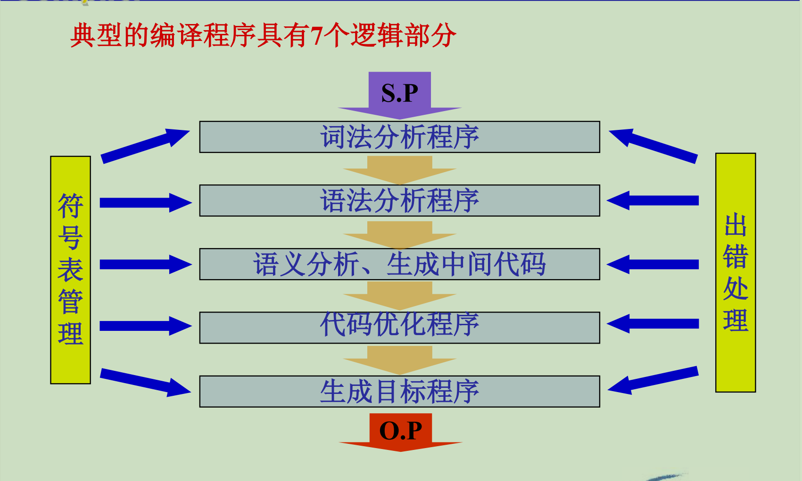

# 基本概念

用高级语言编制的程序，计算机不能立即执行，必须通过一个“翻译程序”加工，转化为与其等价的机器语言程序，机器才能执行。这种翻译程序，称之为“编译程序”。

1. 源程序：用汇编语言或高级语言编写的程序称为源程序。

2. 目标程序：用目标语言所表示的程序

3. 翻译程序：将源程序转换为目标程序的程序称为翻译程序。它是指各种语言的翻译器，包括汇编程序和编译程序，是汇编程序、编译程序以及各种变换程序的总称。

源程序是翻译程序的输入，目标程序是翻译程序的输出

若源程序用汇编语言书写，经过翻译程序得到用机器语言表示的程序，这时的翻译程序就称之为汇编程序，这种翻译过程称为“汇编”(Assemble)

若源程序是用高级语言书写，经加工后得到目标程序，这种翻译过程称“编译”(Compile)

4. 解释程序：对源程序进行解释执行的程序。

编译：先翻译，再运行。

解释：边分析，边执行。

# 编译过程

编译过程是指将高级语言程序翻译为语义等价的目标程序的过程。

编译程序的五/六个阶段：词法分析 → 语法分析 → 语义分析，生成中间代码 → 代码优化 → 生成目标程序

## 1.词法分析

任务：分析和识别单词。

源程序是由字符序列构成的，词法分析扫描源程序(字符串),根据语言的词法规则分析并识别单词，并以某种编码形式输出

## 2.语法分析

任务：根据语法规则（即语言的文法），分析并识别出各种语法成分，如表达式、各种说明、各种语句、 过程、函数等，并进行语法正确性检查。

## 3.语义分析、生成中间代码

任务：对识别出的各种语法成分进行语义分析，并产生相应的中间代码。

根据赋值语句的语义，生成中间代码。即用一种语言形式来代替另一种语言形式，这是翻译的关键步骤。（翻译的实质：语义的等价性）

## 4.代码优化

任务：目的是为了得到高质量的目标程序。

## 5.生成目标程序

由中间代码很容易生成目标程序（地址指令序列）。这部分工作与机器关系密切 ，所以要根据机器进行。在做这部分工作时（要注意充分利用目标机特性），也可以进行优化处理。

在上列五个阶段中都要做两件事：

（1）建表和查表；（2）出错处理；

所以编译程序中都要包括符号表管理和出错处理两部分

遍：对源程序（包括源程序中间形式）从头到尾扫描一次，并做有关的加工处理 ，生成新的源程序中间形式或目标程序，通常称之为一遍。

根据编译程序各部分功能，将编译程序分成前端和后端。

前端：通常将与源程序有关的编译部分称为前端。

词法分析、语法分析、语义分析、中间代码生成

特点：与源语言有关

后端：与目标机有关的部分称为后端。

代码优化、目标代码生成

特点：与目标机有关

