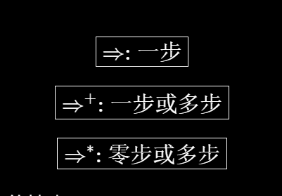
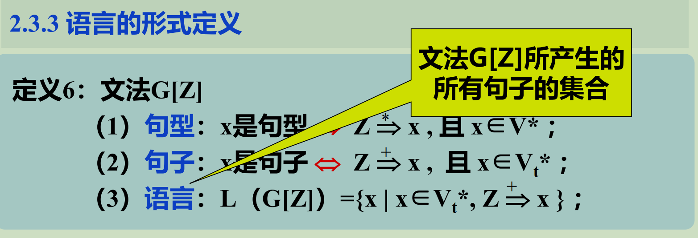
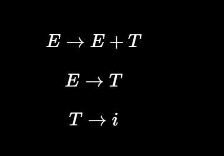
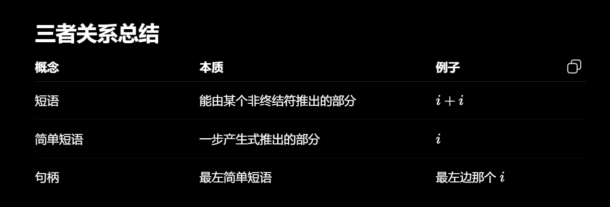

# 字母表和符号串

空符号串：无任何符号的符号串(ε)

符号串： 符号的有穷序列 例：a, aa, ac, abc，..

符号串集合的乘积运算：令A、B为符号串集合，
定义 AB＝{ xy |x∈A, y∈B}

因为εx＝xε＝x，所以{ε}A=A {ε} =A

{} A=A {} = {}

符号串集合的幂运算

符号串集合的闭包运算：设A是符号串集合，定义

A＋＝ A1 ∪ A2 ∪ A3 ∪……∪ An ∪……称为集合A的正闭包。

A*＝ A0 ∪A＋称为集合A的闭包。

A0 ={ε}

# 文法的非形式讨论

文法是对语言结构的定义与描述。即从形式上用于描述和规定语言结构的称为“文法”（或称为“语法”）

规定用“::=”表示“由...组成”

由规则推导句子：有了一组规则之后，可以按照一定的方式用它们去推导或产生句子。

推导方法：从一个要识别的符号开始推导，即用相应规则的右部来替代规则的左部，每次仅用**一条规则**去进行推导。

这种推导一直进行下去，直到所有带< >的符号都由终结符号替代为止。

有若干语法成分同时存在时，我们总是从最左的语法成分进行推导，这称之为最左推导，类似的有最右推导(还有一般推导)

所谓文法是在形式上对句子结构的定义与描述，而未涉及语义问题。

语法（推导）树：我们用语法（推导）树来描述一个句子的语法结构。

# 文法和语言的形式定义
## 文法的定义
定义1. 文法G=（Vn，Vt，P，Z）

Vn：非终结符号集

Vt：终结符号集

P：产生式或规则的集合

Z：开始符号（识别符号） Z∈Vn

规则的定义：

规则是一个有序对(U, x), 通常写为:

U ::= x 或U → x ， | U| = 1 |x| >= 0

注：产生式左边符号构成集合Vn，且 Z ∈Vn

给定一个 文法，需给出产生式（规则）集合，并指定识别符号

有些产生式具有相同的左部，可以合在一起

规范推导：有xUy ==> xuy, 若 y ∈Vt* ,则此推导为规范的，记为 xUy ==>| xuy

直观意义：规范推导＝最右推导
最右推导：若规则右端符号串中有两个以上的非终结符时，先推右边的。
最左推导：若规则右端符号串中有两个以上的非终结符时，先推左边的。

## 语言的形式定义

已知文法，求语言，通过推导；

已知语言，构造文法，无形式化方法，更多是凭经验

语言是文法G[Z]所产生的所有句子的集合

G和G’是两个不同的文法，若 L(G) = L(G’) ,则G和G’为等价文法。

## 递归文法

1.递归规则：规则右部有与左部相同的符号（非终结符）

对于 U::= xUy

若x=ε, 即U::= Uy， 左递归

若y=ε, 即U::= xU， 右递归

若x, y≠ε，即U::= xUy，自嵌入递归

2.递归文法：文法G，存在U ∈Vn

if U==>…U…, + 则G为递归文法；

if U==>U…, + 则G为左递归文法；

if U==>…U, + 则G为右递归文法。

## 句型的短语、简单短语和句柄

从开始符号 S 出发，通过若干次推导得到的任何字符串，都叫**句型**。

给定文法G[Z], w = xuy∈V+，为该文法的句型

若 Z ==> xUy, * 且U ==> ＋u, 则u是句型w相对于U的短语；

若 Z ==> xUy, * 且U ==>u, 则u是句型w相对于U的简单短语。

其中U ∈Vn，u ∈V+，x , y ∈V*

简单理解：

一个句型中，如果某一部分可以由某个非终结符 A 推导出来，那么这一部分就是一个**短语**。

能够直接由某个产生式右部得到的部分，就是**简单短语**。

一个句型的最左简单短语叫做**句柄**。

例子：

关系：

句柄⊂简单短语⊂短语

# 语法树与二义性文法

**语法（推导）树**：句子(句型)结构的图示表示法，它是有向图，由结点和有向边组成。

语法树的生长规律不同，但最终生成的语法树形状完全相同。某些文法有此性质，而某些文法不具此性质。

**子树**：语法树中的某个结点（子树的根）连同它向下派生的部分所组成

**短语** = 语法树中某个非终结符节点的所有叶子组成的部分。

句型推导过程 <==> 该句型语法树的生长过程

## 由推导构造语法树

从识别符号开始，自左向右建立推导序列。

即由根结点开始，自上而下建立语法树。

## 由语法树构造推导

自下而上地修剪子树的某些末端结点（短语），直至把整棵树剪掉（留根），每剪一次对应一次归约。

从句型开始，自右向左地逐步进行归约，建立推导序列。

对句型中最左简单短语（句柄）进行的归约称为**规范归约**

通过规范推导或规范归约所得到的句型称为**规范句型**

## 文法的二义性

若对于一个文法的某一句子（或句型）存在两棵不同的语法树，则该文法是二义性文法，否则是无二义性文法。

换而言之，无二义性文法的句子只有一棵语法树，尽管推导过程可以不同。

若一个文法的某句子存在两个不同的规范推导，则该文法是二义性的，否则是无二义性的。

若一个文法的某规范句型的句柄不唯一，则该文法是二义性的，否则是无二义性的。

注：文法的二义性是不可判定的

两种解决方法：

1. 提出一些限制条件，称为无二义性的充分条件，当文法满足这些条件时，就可以判定文法是无二义性的。

2. 即不改变二义性文法，而是确定一种编译算法，使该算法满足无二义性充分条件。

## 多余规则

（1）在推导文法的所有句子中，始终用不到的规则。即该规则的左部非终结符不出现在任何句型中（不可达符号）
（2）在推导句子的过程中，一旦使用了该规则，将推不出任何终结符号串。即该规则中含有推不出任何终结符号串的非终结符（不活动符号）

若某文法中无有害规则或多余规则，则称该文法是压缩过的

## 文法扩充的BNF表示

| EBNF 符号  | 含义                       | 例子           |     |     |
| ---------- | -------------------------- | -------------- | --- | --- |
| \([\,]\)   | 可有可无，出现 0 次或 1 次 | ([+            | -]) |     |
| \(\{\,\}\) | 重复 0 次或多次            | \(\{<数字>\}\) |     |     |
| \((\,)\)   | 分组                       | ((a            | b)) |     |
| (          | )                          | 任选一个       | (a  | b)  |

# 文法和语言定义

乔姆斯基Chomsky将所有文法都定义为一个四元组：

G=（Vn，Vt，P，Z）

Vn：非终结符号集

Vt：终结符号集

P：产生式或规则的集合

Z：开始符号（识别符号） Z∈Vn

0型、1型、2型、3型

0型： P： u ::= v，其中 u∈V＋，v∈V* V = Vn∪ Vt

0型文法称为短语结构文法。规则的左部和右部都可以是符号串，一个短语可以产生另一个短语。

0型语言：L0 这种语言可以用图灵机(Turing)接受。

1型： P： xUy ::= xuy，其中 U∈Vn，x、y、u∈V*

称为上下文敏感或上下文有关。也即只有在x、y这样的上下文中才能把U改写为u

1型语言：L1 这种语言可以由一种线性界限自动机接受。

2型： P： U ::= u，其中 U∈Vn，u∈V*

称为上下文无关文法。也即把U改写为u时，不必考虑上下文。(1型文法的规则中x，y均为 ε 时即为2型文法)

2型语言：L2 这种语言可以由下推自动机接受

3型：

（左线性）

P： U ::= t或 U ::= Wt，其中 U、W∈Vn，t∈Vt

（右线性）

P： U ::= t或 U ::= tW，其中 U、W∈Vn，t∈Vt

3型文法称为正则文法。它是对2型文法进行进一步限制

3型语言：L3 又称正则语言、正则集合，这种语言可以由有穷自动机接受。