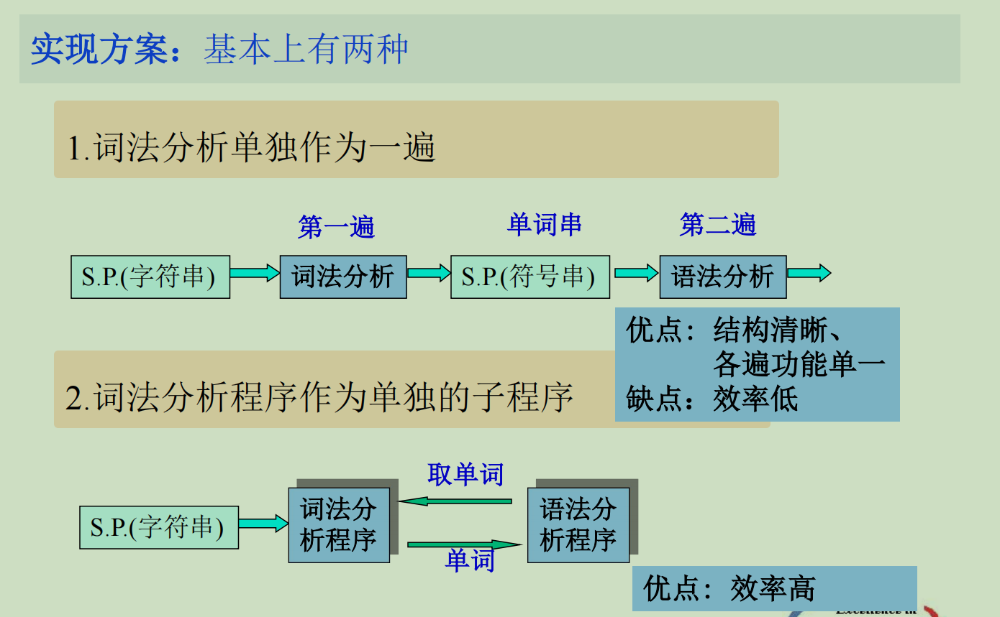
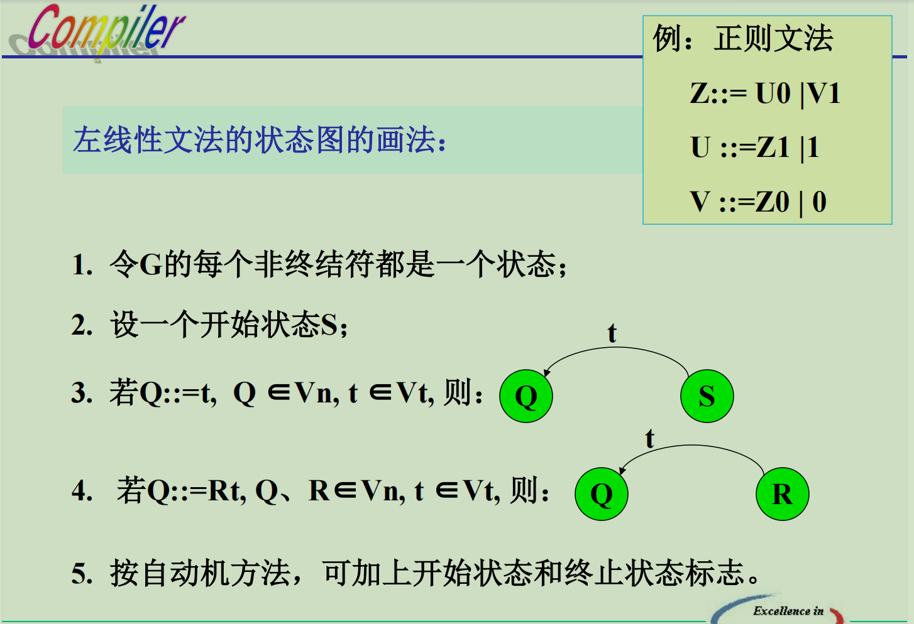

# 词法分析程序的功能

1. 词法分析：根据词法规则识别及组合单词，进行词法检查。

2. 删去空格字符和注释。

3. 对数字常数完成数字字符串到数值的转换。

单词的种类
1. 保留字：begin、end、for、do... 
2. 标识符：由用户定义，表示各种名字
3. 常 数：无符号数、布尔常数、字符串常数等
4. 分界符：+、-、*、/、...

由字符串变为单词串

# 正则文法和状态图

自底向上分析，每次对句柄进行规约

右线性文法与其相反，自顶向下分析，需要假如终止状态

状态图的实现——构造词法分析程序