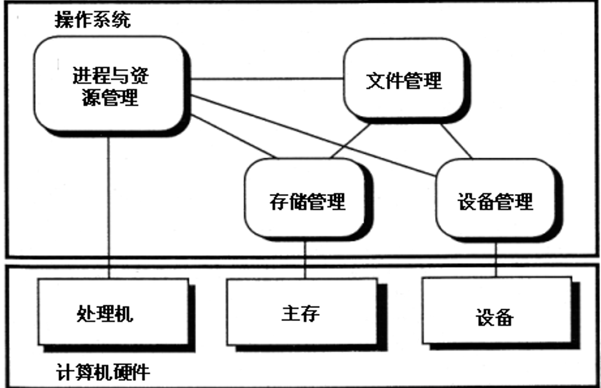

欢迎进入os的学习！

在这段漫长的旅程开始之前，让我们先来了解一下何为os，为什么要用os

下面是我个人对os的理解。

在我看来，操作系统两大**核心思想**无非就是：

1. 向上提供接口，向下屏蔽差异

2. 同时进行资源调度与竞争管理，并发控制与安全隔离

# 何为操作系统？

操作系统是裸机之上的**第一层系统软件**，通过**进程**、**内存**、**设备**、**文件**四大管理，统一调度计算机所有硬件资源，向上为应用和用户提供简洁、安全、通用的使用接口

我们接下来的学习也会围绕这四大管理功能来展开

# 为什么需要操作系统

1. 对硬件：抽象与仲裁
   
裸机硬件接口复杂、指令底层。操作系统把硬件封装成统一、简单接口；

同时充当硬件资源裁判，多个程序竞争 CPU、内存、磁盘、外设时，由 OS 公平、安全分配资源，防止冲突。

2. 对应用程序：简化开发
   
应用软件不需要分别适配不同型号 CPU、显卡、磁盘。只调用操作系统提供 API 即可，实现程序可移植，大幅降低软件开发难度。

3. 对用户：易用性
   
提供命令行 / 图形界面，用户不用操作硬件指令，通过文件、窗口直接使用计算机资源。

4. 安全与隔离

操作系统建立隔离机制：进程空间隔离、文件权限，一个程序崩溃不容易牵连整个系统；限制非法访问硬件与数据。

# 操作系统四大核心功能

1. 进程管理（处理器管理）

CPU 是计算机核心硬件，多个程序都想抢占 CPU。

操作系统负责：创建 / 终止进程、进程调度、分配 CPU 时间、进程同步与通信。

作用：让多个程序并发运行，合理分配 CPU，避免程序互相争抢、混乱，保障任务有序执行

2. 存储管理（内存管理）

管理物理内存，完成内存分配、地址转换、内存保护、虚拟内存。

作用：给程序分配可用内存，防止程序篡改彼此数据；利用虚拟内存突破物理内存上限，让更多程序同时运行

3. 设备管理（I/O管理）

管理键盘、显示器、磁盘、网卡、打印机等外部设备，提供驱动、缓冲、设备分配。

作用：屏蔽五花八门硬件的底层差异；应用程序不用直接操作硬件，统一调用 OS 接口；协调多个程序共享外设，提升 I/O 效率。

4. 文件系统管理

在外存（硬盘、U 盘）上组织数据，管理文件目录、读写、权限、存储空间。

作用：把磁盘上零散二进制数据抽象成文件、文件夹；提供命名、保存、查找、权限控制，方便用户与程序持久保存数据。

让我们带着上面的地图，开启os之旅吧！