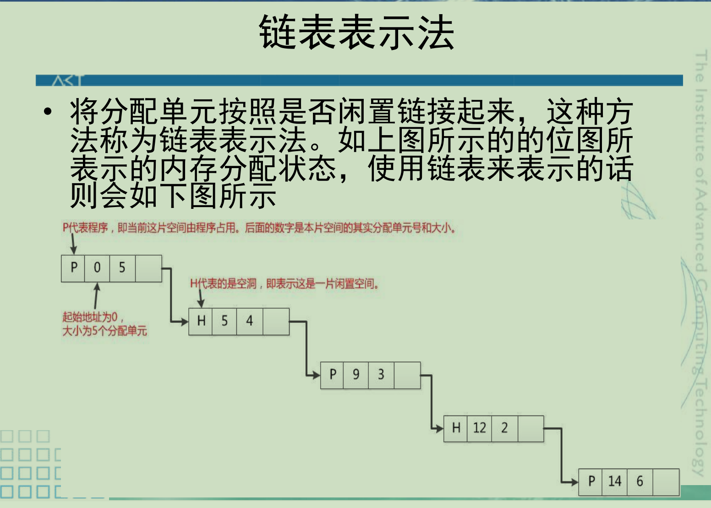
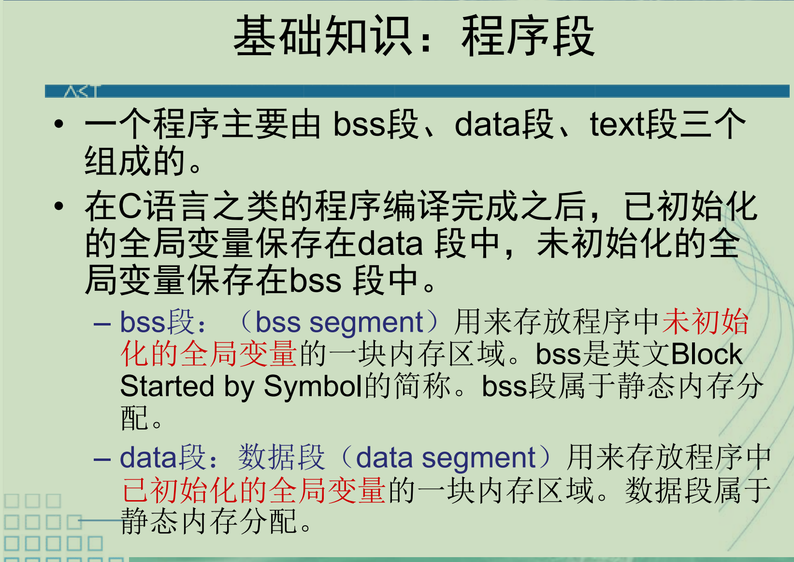
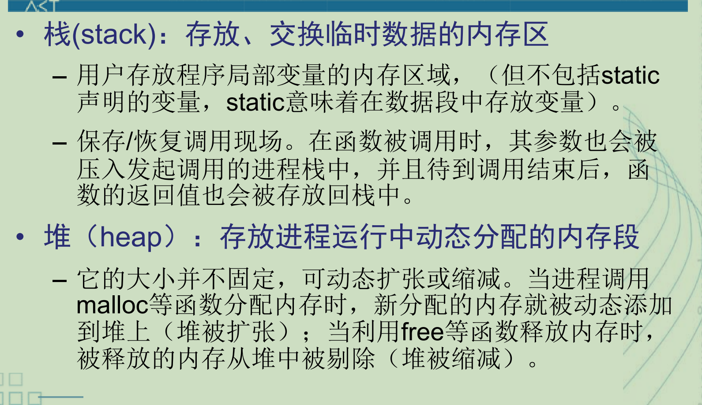
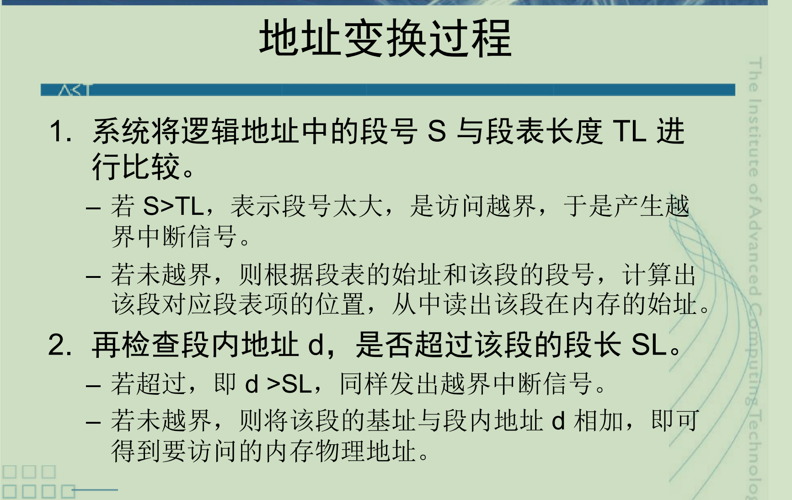
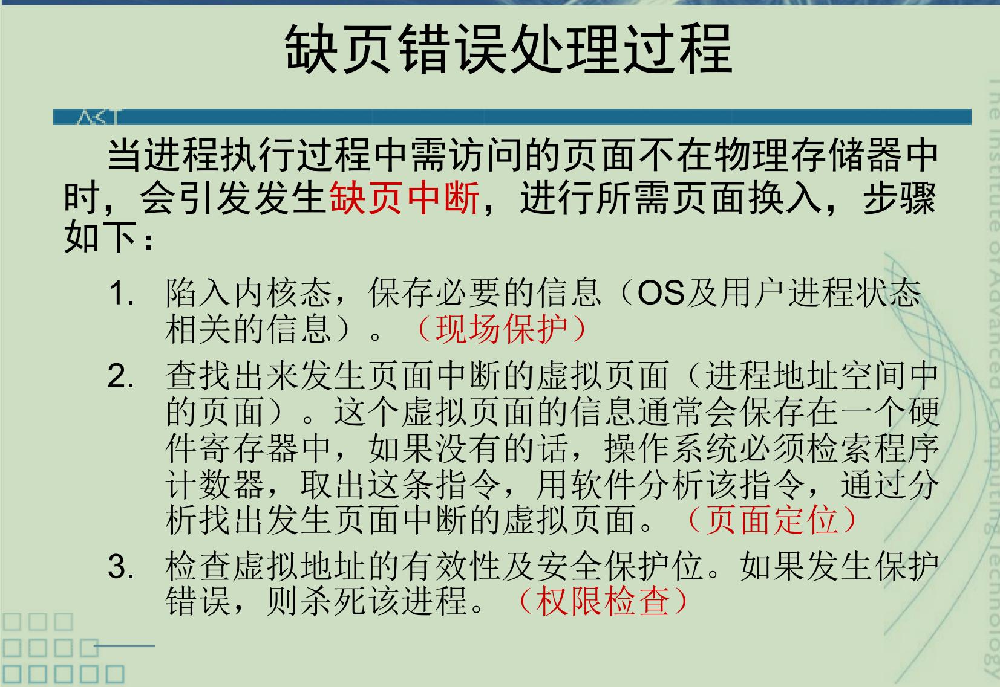
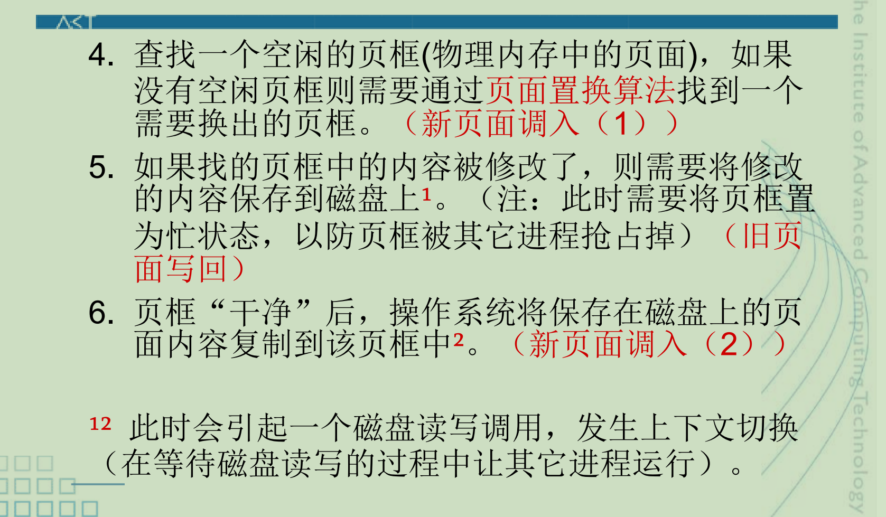
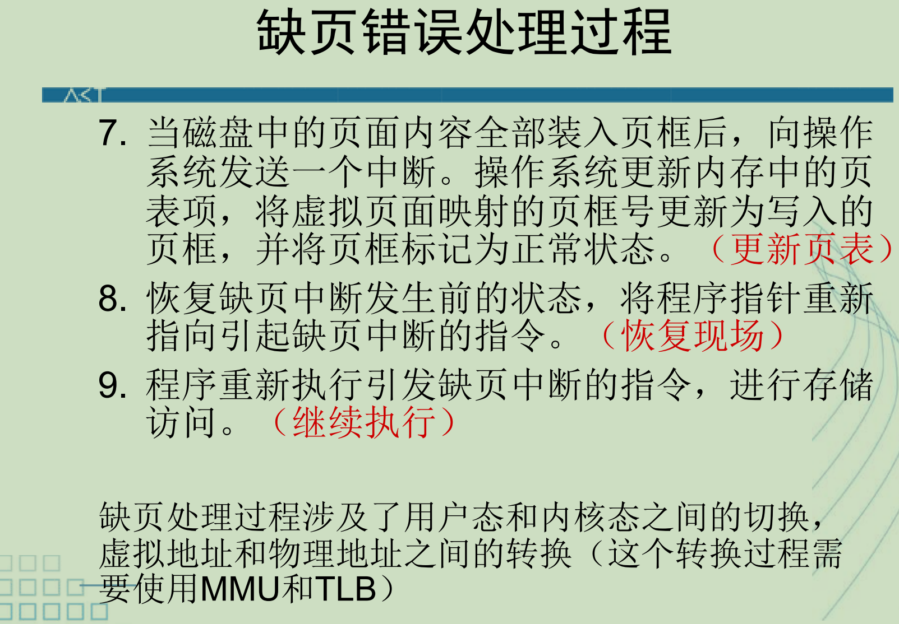

**内存分配**分为两大类：

**连续**分配和**离散**分配

下面先了解下影响存储分配性能的碎片

# 碎片

内存中无法被利用的存储空间称为碎片。

## 内部碎片（Internal Fragmentation）

分配给进程，但进程用不完、留在进程分配块内部的空闲空间。

成因：内存分配单位固定（分页、固定分区）；进程请求大小 <分配块大小，多出的空间被 “打包在块里”，别的进程无法使用。

例子：页大小 4KB，进程只需要 3KB，剩下 1KB 就是内部碎片。

特点：碎片藏在已分配块内部；不会随分配释放产生新空闲小块；无法通过紧凑消除。

## 外部碎片（External Fragmentation）

内存里存在多个不连续的空闲小块，每一块都太小，无法满足新进程连续内存需求。

成因：动态可变大小分配（分段、可变分区）；进程不断分配、释放，空闲内存被分割成零散空隙。

例子：空闲内存总共有 10MB，但分散成很多 1MB 小块；新进程要 3MB，虽然总量够，但找不到连续 3MB 空间。

特点：碎片在已分配块之间；空闲空间是独立空闲块；可以通过内存紧凑（Compaction）消除（代价高，需要拷贝进程）。

外部碎片才是造成内存系统性能下降的主要原因。

消除外部碎片的方法：紧凑技术

# 连续分配

进程在物理内存中占用一段连续地址空间

## 固定分区分配

系统启动前 / 初始化时，把内存预先划分为若干大小固定的分区

## 可变分区分配

初始内存是一整块空闲区；作业装入时才动态划分分区，分区大小刚好等于作业大小；作业撤离后回收分区、空闲区可以合并。

可变分区分配操作主要有两个：

### 操作一：分配内存（重）

当一个进程进入内存时，操作系统需要：

1. 查看进程需要多大内存
2. 在空闲分区表中找合适的空闲区
3. 如果空闲区大小刚好，就整块分配
4. 如果空闲区比进程大，就切出一部分给进程
5. 修改空闲分区表和已分配分区表
   
**内存分配算法**：

1. 首次适应算法（First Fit）：每个空白区按其在存储空间中地址递增的顺序连在一起，在为作业分配存储区域时，从这个空白区域链的始端开始查找，选择第一个足以满足请求的空白块。

2. 下次适应算法（Next Fit）：把存储空间中空白区构成一个循环链，每次为存储请求查找合适的分区时，总是从上次查找结束的地方开始，只要找到一个足够大的空白区，就将它划分后分配出去。

3. 最佳适应算法（Best Fit）：为一个作业选择分区时，总是寻找其大小最接近于作业所要求的存储区域。

4. 最坏适应算法（Worst Fit）：为作业选择存储区域时，总是寻找最大的空白区。

5. 快速适应算法，又称为分类搜索法，把空闲分区按容量大小进行分类，经常用到长度的空闲区设立单独的空闲区链表。系统为多个空闲链表设立一张管理索引表。

该算法在分配时，不会对任何分区产生分割


### 操作二：回收内存

当进程结束时，操作系统要释放它占用的分区。

回收时最重要的是：

看释放区的前后是否有相邻空闲区，如果有，要合并。


## 闲置空间的管理



### 位图表示法

– 空间成本固定：不依赖于内存中的程序数量。

– 时间成本低：操作简单，直接修改其位图值即可。

– 没有容错能力：如果一个分配单元为1，不能肯定应该为1还是因错误变成1。

### 链表表示法

– 空间成本：取决于程序的数量。

– 时间成本：链表扫描通常速度较慢，还要进行链表项的插入、删除和修改。

– 有一定容错能力：因为链表有被占空间和闲置空间的表项，可以相互验证。


# 伙伴系统

伙伴系统（Buddy System） 是一种动态内存分配算法，主要用来解决连续内存分配中的分配效率和碎片合并问题。

它的核心思想是：

把内存按 2 的幂次大小进行划分；分配时不断二分，回收时和“伙伴块”合并。

如果进程申请的大小不是 2 的幂，就向上取整。

伙伴系统的优点之一就是：

回收时合并规则明确，效率较高

两个空闲块要合并，必须满足：

1. 大小相同
2. 地址相邻
3. 来自同一个大块的二分

伙伴系统最大内部碎片小于所分配块大小的一半。

# 重定位

把程序里的逻辑地址（相对地址）转换成物理内存地址。

静态重定位：程序**装入**内存时一次性完成地址转换，运行期间不再修改地址。

动态重定位：程序**运行**时才实时转换地址，依靠硬件（重定位寄存器 / MMU）动态换算

# 补充知识：程序段



text和data段都在链接后的可执行文件中，由系统从可执行文件中加载，而bss段不在可执行文件中，由系统初始化。

一个装入内存的可执行程序，除了bss、data和text段外，还需构建一个栈（stack）和一个堆（heap）



```
int some_global_variable;
//全局变量，项目所有的源文件都可以访问
//其他源文件访问时，需要用extern关键字声明，
//否则链接时会报错（同名符号）
static int some_local_variable;
//静态全局变量，仅仅当前源文件可以访问
main() {
int some_stack_variable;
//栈分配，仅仅当前函数可以访问
...
}
```

# 离散分配

进程物理地址不连续，拆成多块分散存放

分为页式存储（分页），段式存储（分段），段页式存储

# 页式内存管理

**注**：页式管理不是固定分区

在分页存储管理系统中，把每个作业的地址空间分成一些大小相等的片，称之为页面或页。

在分页存储管理系统中，把主存的存储空间也分成与页面相同大小的片，这些片称为存储块，或称为页框


## 二级页表示例（重）
```
虚拟地址
  |
  v
页目录索引 PDX -> 页目录项 PDE -> 找到页表
  |
  v
页表索引 PTX -> 页表项 PTE -> 找到物理页
  |
  v
页内偏移 offset -> 物理地址
```
页表快速访问机制依赖于MMU

## 哈希页表

站在虚拟页角度：

我有哪些虚拟页被使用？

这些虚拟页映射到哪些物理页？

它还是在回答：

虚拟页 -> 物理页

只是用哈希表组织。

## 反置页表

站在物理页角度：

每个物理页现在被哪个进程的哪个虚拟页占用？

它是反过来记录：

物理页 -> 进程 + 虚拟页

但查找时仍然要通过 PID + VPN 找到对应物理页。

# 段式存储管理

段式存储管理把程序划分成若干个逻辑段，每一段有自己的名字、长度和起始地址，程序访问内存时使用“段号 + 段内偏移”。

逻辑地址 = 段号 + 段内偏移

段表项通常包含：段号, 段长 limit, 段基址 base, 访问权限

| 对比             | 页式存储管理                 | 段式存储管理       |
| ---------------- | ---------------------------- | ------------------ |
| 划分依据         | 按固定大小划分               | 按程序逻辑结构划分 |
| 基本单位         | 页                           | 段                 |
| 大小             | 页大小固定                   | 段大小不固定       |
| 地址形式         | 页号 + 页内偏移              | 段号 + 段内偏移    |
| 是否符合程序逻辑 | 不明显                       | 明显               |
| 碎片类型         | 主要有内部碎片               | 主要有外部碎片     |
| 是否要求连续     | 每页内部连续，进程整体不连续 | 每段内部连续       |
| 保护共享         | 不如段式直观                 | 很方便             |



# 段页式存储管理（重）

用段式体现程序逻辑，用页式解决外部碎片问题

段页式的逻辑地址通常由三部分组成：

逻辑地址 = 段号 + 段内页号 + 页内偏移

段页式中，一般需要两级表：

段表和页表

1. 根据段号 s 查段表
2. 检查段号是否合法
3. 检查段内页号 p 是否超过该段长度
4. 找到该段对应的页表
5. 根据段内页号 p 查页表
6. 得到物理块号 b
7. 物理地址 = b × 页大小 + 页内偏移 d

类似于二级页表


# 虚拟存储管理

**对虚拟内存的定义是基于对地址空间的重定义的，即把地址空间定义为“连续（时间、空间）
的虚拟内存地址”，以借此“欺骗”程序，使它们以为自己正在使用一大块的“连续”地址。**

核心思想：**按需装载，缺页调入**

• 像覆盖技术那样，不是把程序的所有内容都放在内存中，因而能够运行比当前的空闲内存空间还要大的程序。但做得更好，由操作系统自动来完成，无须程序员的干涉；

• 像交换技术那样，能够实现进程在内存与外存之间的交换，因而获得更多的空闲内存空间。但做得更好，只对进程的部分内容(更小的粒度，如分页)在内存和外存之间进行交换。

注：
1. 提供给用户可用的虚拟内存空间通常大于物理内存

2. 虚拟存储量的扩大是以牺牲 CPU 工作时间以及内外存交换时间为代价。

3. 虚拟内存的最大容量由计算机的地址结构决定。如32 位机器，虚拟存储器的最大容量就是 4G，再大CPU 无法直接访问。

4. 如果作业/进程运行前必须全部装入内存，这属于实存管理；如果允许一部分在内存、一部分在外存，需要时再调入，这属于虚拟存储管理。

## 地址映射问题


## 页面调入问题


## 缺页问题





## 页面置换算法（重）

1. 先进先出，FIFO,最简单的置换算法

在使用FIFO算法作为缺页置换算法时，分配的页面增多，但缺页率反而提高，这样的异常现象称为**Belady Anomaly**

2. 改进的FIFO算法—Second Chance

– A是FIFO队列中最旧的页面，且其放入队列后没有被再次访问，则A被立刻淘汰；否则如果放入队列后被访问过，则将A移到FIFO队列头，并且将访问标志位清除。

– 如果所有的页面都被访问过，则经过一次循环后就会按照FIFO的原则淘汰。

3. Clock是Second Chance的改进版，也称最近未使用算法(NRU, Not Recently Used)。通过一个环形队列，避免将数据在FIFO队列中移动。算法如下：

– 产生缺页错误时，当前指针指向C，如果C被访问过，则清除C的访问标志，并将指针指向D；

– 如果C没有被访问过，则将新页面放入到C的位置, 置访问标志，并将指针指向D。

4. 最近最少使用（Least recently used）- LRU

– 设置一个特殊的栈，保存当前使用的各个页面的页面号。

– 每当进程访问某页面时，便将该页面的页面号从栈中移出，将它压入栈顶。栈底始终是最近最久未使用页面的页面号。

工作集与驻留集管理

• 进程的工作集（working set）：当前正在使用的页面的集合。

• 进程的驻留集（Resident Set ）：虚拟存储系统中，每个进程驻留在内存的页面集合，或进程分到的物理页框集合。

**抖动问题(thrashing)**
• 随着驻留内存的进程数目增加，或者说进程并发水平(multiprogramming level)的上升，处理器利用率先是上升，然后下降。

# 易错题
```
8．假设某系统采用二级页表，内存的单次物理访问时间为100ns。TLB的访问时间为10ns，TLB命中率为95%。此外，系统配有L1 Cache，Cache的访问时间为5ns，命中率为98%。假设页表项和实际数据都可以被缓存在L1 Cache中。
(1)在最佳情况（TLB命中且数据在Cache中命中）下，CPU获取到目标数据需要多长时间？ 
(2)计算该系统在运行中获取目标数据的平均内存访问时间（Effective Access Time, EAT）

答：
（1）15ns。
最佳情况下，TLB命中且数据在Cache中命中，CPU获取数据的时间为TLB访问时间与Cache访问时间之和：10ns + 5ns = 15ns。
（2）17.59ns
平均内存访问时间（EAT）的计算需要考虑TLB命中与未命中两种情况，以及页表项和数据在Cache中的命中情况。
TLB命中时，数据访问的期望时间为：5ns × 0.98 + 100ns × 0.02 = 6.9ns，故总时间为10ns + 6.9ns = 16.9ns。

TLB未命中时，需进行两次页表访问和一次数据访问，每次访问的期望时间均为6.9ns，故总时间为10ns + 2 × 6.9ns + 6.9ns = 30.7ns。
因此，EAT = 0.95 × 16.9ns + 0.05 × 30.7ns = 17.59ns
```