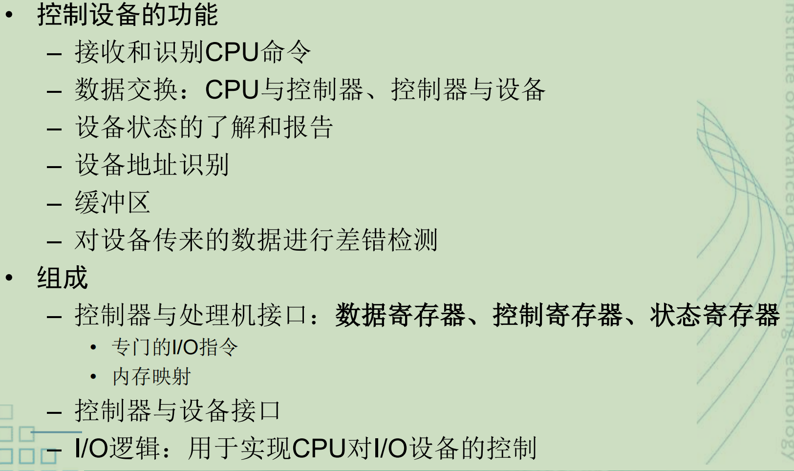
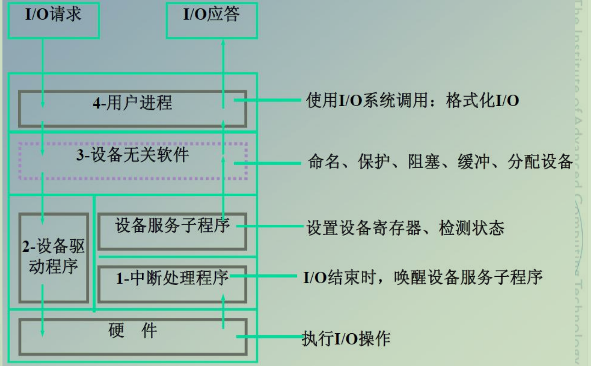
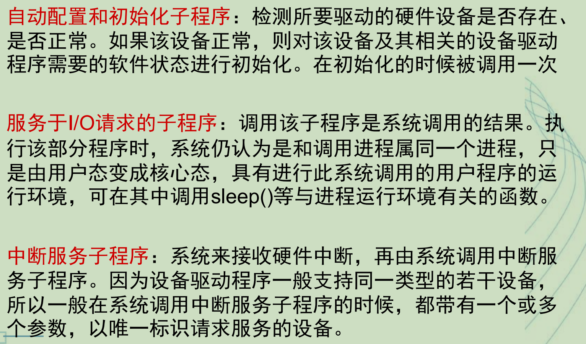

# I/O设备分类

类型

–传输速度：低速、中速、高速

–信息交换单位：**块设备和字符设备**

–共享属性：独占设备、共享设备、虚拟设备

设备与控制器之间的接口

–数据信号

–控制信号

–状态信号

# I/O端口地址

I/O 端口地址是 CPU 用来访问外部设备控制器中寄存器的地址。

1.**独立编址**，也叫 I/O 单独编址

I/O 端口地址和内存地址是分开的。

2.**统一编址**，也叫内存映像 I/O

I/O 端口地址和内存地址使用同一个地址空间。

也就是说，把设备寄存器看成“特殊的内存单元”。

# 设备控制器

**内存映射I/O不允许对一个控制寄存器的内容进行高速缓存**

因为缓存后对设备控制寄存器读取将不会设备的实际状态进行检测。

# I/O控制技术（重）

轮询：CPU 一直问。

中断驱动：设备有事叫 CPU。

DMA：DMA 帮 CPU 搬数据。

通道：专门的小处理器管理 I/O。

DMA 全称是 Direct Memory Access，直接存储器访问。

在这种方式下，CPU 只负责初始化传输任务，比如告诉 DMA 控制器：

从哪里读、写到哪里、传多少数据。

之后数据传输由 DMA 控制器 直接在 I/O 设备和内存之间完成，不需要 CPU 逐字节搬运。

传输完成后，DMA 再用中断通知 CPU。

数据量较大且连续，DMA可减少CPU干预，让CPU与I/O并行。

通道是一种更高级的 I/O 控制方式，可以理解为一个专门负责 I/O 的小型处理器。

CPU 只需要发出 I/O 命令，之后由 通道 执行通道程序，完成一系列复杂的 I/O 操作。

也就是说，通道不仅能搬运数据，还能控制多个设备、执行多个 I/O 指令。

# 缓冲技术（重）

缓冲区通常位于内存中。

I/O设备  ←→  缓冲区  ←→  用户程序

缓冲技术可提高外设利用率。

–匹配CPU与外设的不同处理速度:

缓冲区可以让 CPU 不必一直等待设备。

–减少对CPU的中断次数:

有了缓冲区后，可以先积累一批数据，再统一通知 CPU 处理。

–提高CPU和I/O设备之间的并行性:

CPU 可以处理数据，I/O 设备同时进行输入输出。

常见方式有**单缓冲、双缓冲**、循环缓冲、缓冲池；

双缓冲要求要求CPU和外设的速度相近

# 设备驱动程序

# 设备分配

设备独立性：

应用程序与物理设备无关

SPOOLing程序：

SPOOLing程序和外设进行数据交换：实际I/O

应用程序进行I/O操作时，只是和SPOOLing程序交换数据，可以称为“虚拟I/O”

设备无关软件层的核心作用是：

向上提供统一接口，向下屏蔽具体设备差异。

| 功能                    | 所属层次        |
| ----------------------- | --------------- |
| `printf` 格式化输出     | 用户层 I/O 软件 |
| 二进制整数转 ASCII 字符 | 用户层 I/O 软件 |
| SPOOLing 假脱机         | 用户层 I/O 软件 |
| 设备命名                | 设备无关软件层  |
| 缓冲管理                | 设备无关软件层  |
| 错误报告                | 设备无关软件层  |
| 设备保护                | 设备无关软件层  |
| 磁盘块分配              | 设备无关软件层  |
| 计算磁道、磁头、扇区    | 设备驱动程序    |
| 设置设备寄存器          | 设备驱动程序    |
| 响应设备中断            | 中断处理程序    |
