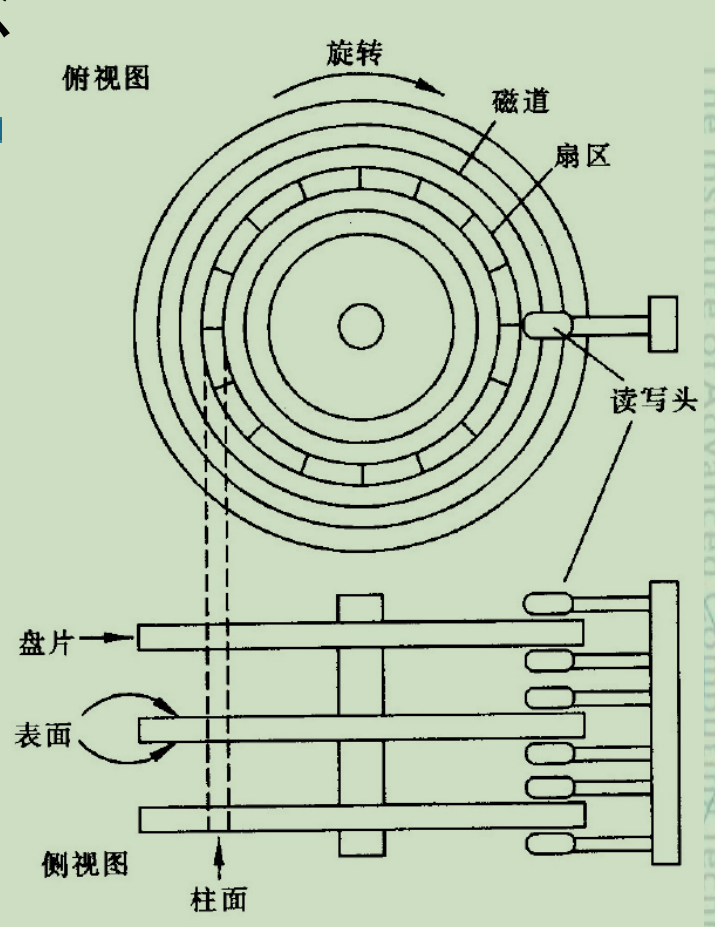
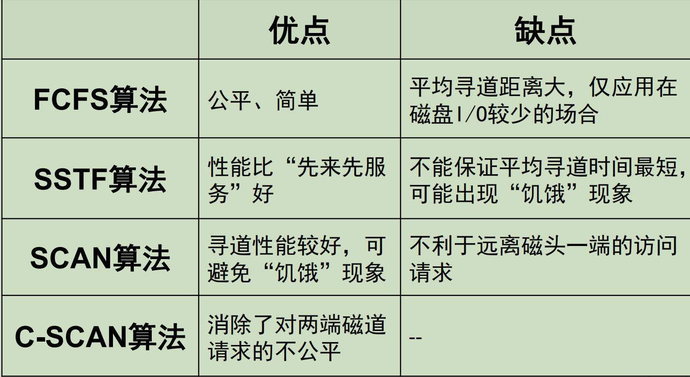
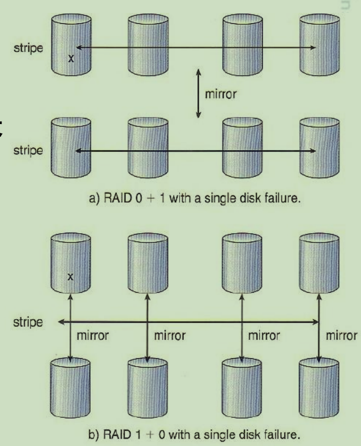
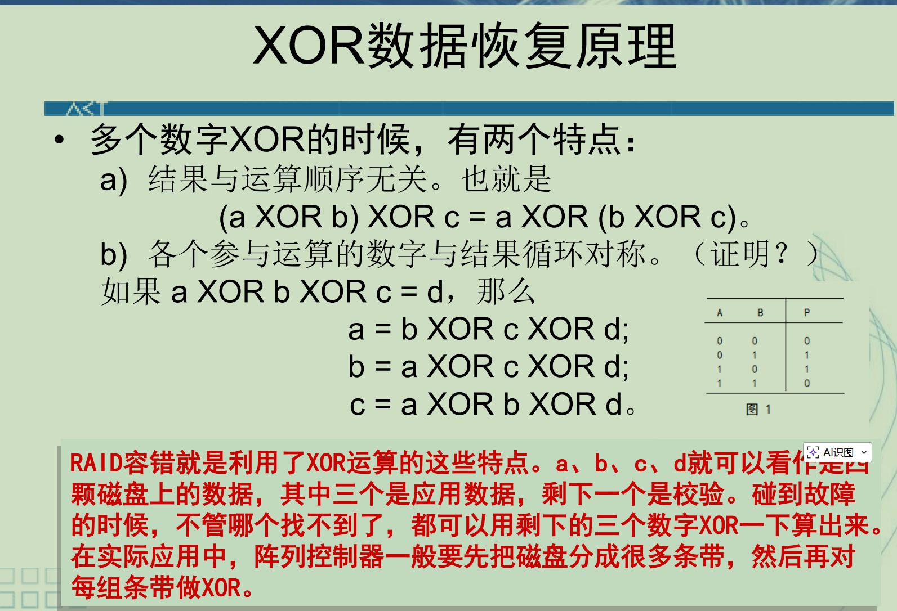
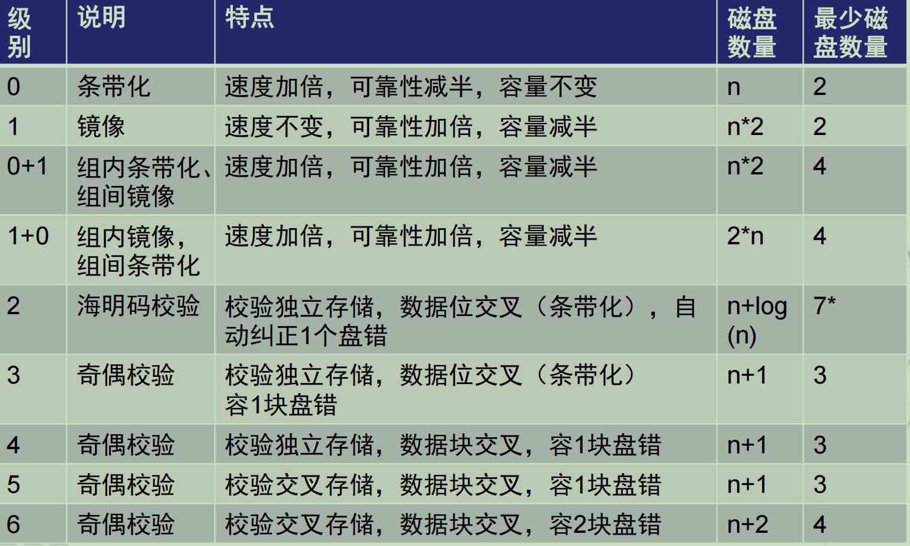

# 磁盘基本概念

磁道，扇区，柱面，磁头

磁带比磁盘有更大容量，磁盘比磁带有更好的随机访问性能



## 磁盘访问时间（重）

• **寻道**时间

• 平均旋转延迟时间

**Tr =1/(2r)**

• 传输时间

# 磁盘调度算法（重）

先来先服务算法（**FCFS**）

缺点：效率不高

最短寻道时间优先算法（**SSTF**）

缺点：可能产生“饥饿” 现象，造成某些访问请求长期等待得不到服务。

改进：

扫描算法（**SCAN**）电梯调度

算法思想：

**必须走到柱面边界才反向**(无论当前方向是否有访问请求)

当有访问请求时，磁头按一个方向移动，在移动过程中对遇到的访问请求进行服务，然后判断该方向上是否还有访问请求，如果有则继续扫描；否则改变移动方向，并为经过的访问请求服务，如此反复。

循环扫描算法（**CSCAN**）

算法思想：

– 按照所要访问的柱面位置的次序去选择访问者。

– 移动臂到达最后一个柱面后，立即带动读写磁头快速返回到0号柱面。

– 返回时不为任何的等待访问者服务。

– 返回后可再次进行扫描。

**“磁臂粘着”现象**：有一个或几个进程对某一磁道有较高的访问频率， 即这个(些)进程反复请求对某一磁道的I/O操作，从而垄断了整个磁盘设备。



# 闪存盘，U盘

Flash Disk的特征是低功耗、大容量、数据访问速度高。

Flash Disk执行一次数据读写的周期比硬盘短。

NAND的地址分为三部分:块号、块内页号、页内字节号。

按页读写，按块擦除

NOR的地址线足够多，且存储单元是并列排布，可以实现一次性的直接寻址。

# RAID（廉价冗余磁盘阵列）
```
RAID 0
该级仅提供了并行交叉存取。它虽然有效提高了磁盘I/O速度，但并无冗余校验功能。
条带化：一个字节块可能存放在多个数据盘上

RAID 1
镜像磁盘冗余阵列，将每一数据块重复存入镜像磁盘
改善磁盘机的可靠性，使有效容量下降了一半，成本较高
镜像：数据完全拷贝一份
RAID 1+0 更可靠

RAID 2
采用海明码纠错的磁盘阵列，将数据位交叉写入几个磁盘中。按位条带化。
XOR数据恢复原理
校验：数据通过某种运算（异或）得出，用以检验该组数字的正确性

RAID 3
一个校验盘，条带化
读写要访问组中所有盘

RAID 4
一个校验盘，非条带化
随机读快，随机写慢

RAID 5
同3，但无校验盘

RAID 6
同5，但双维校验
```


